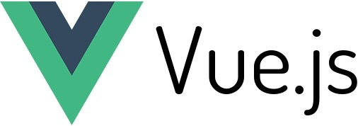

# 🖥️ Vue.js Playground

<h1 align="center">
  
</h1>

## 🔎️ Description

A basic Vue.js 2 application to test basic Vue.js concepts.

This project was made during the <a href="udemy.com/course/vuejs-from-beginner-to-professional/">Vue JS 2: From Beginner to Professional</a> course on Udemy.

## 🚀️ Technologies

- Vue.js 2

---

Thank you and good coding 😎️

Made by **<a href="https://paulophlp.github.io/portfolio/" target="__blank">Paulo Lima 🤓️</a>**
